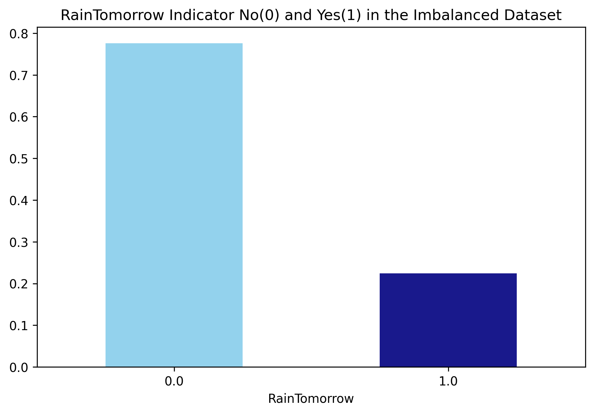
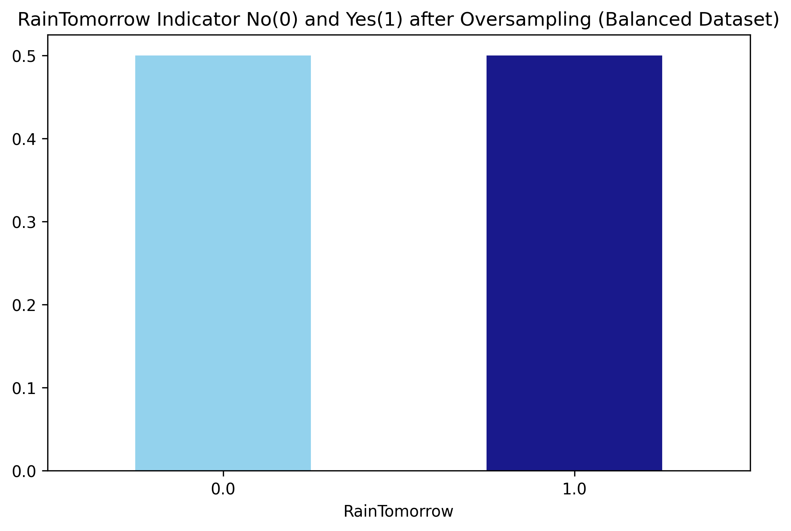
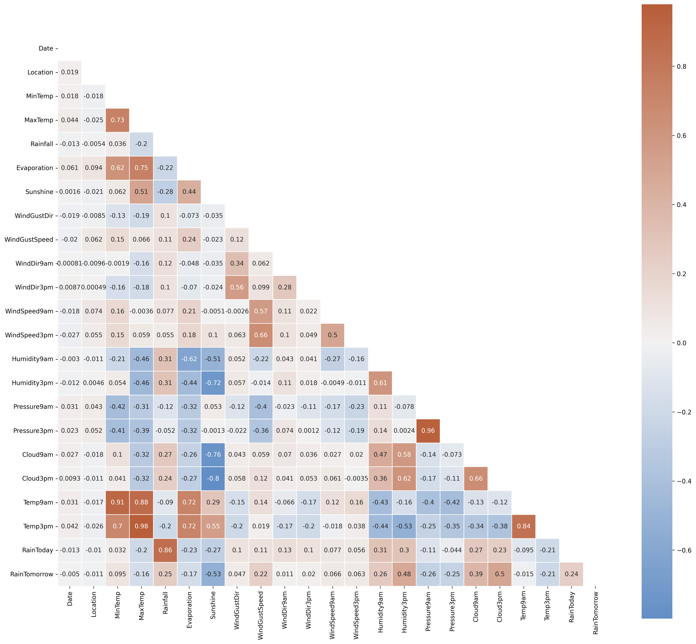
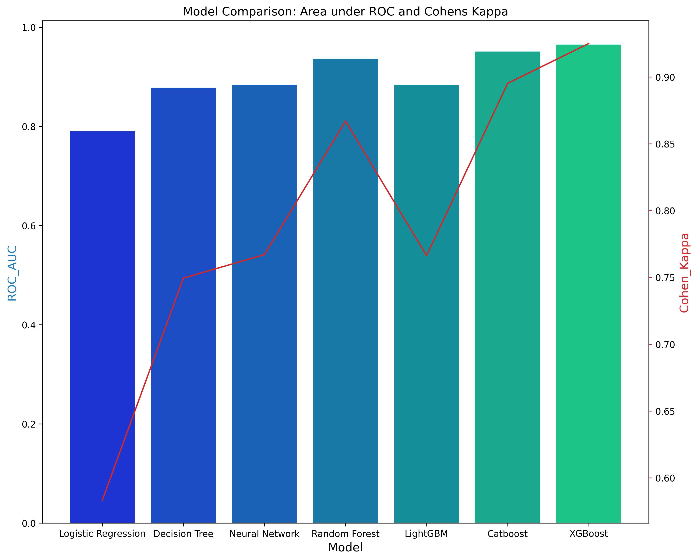
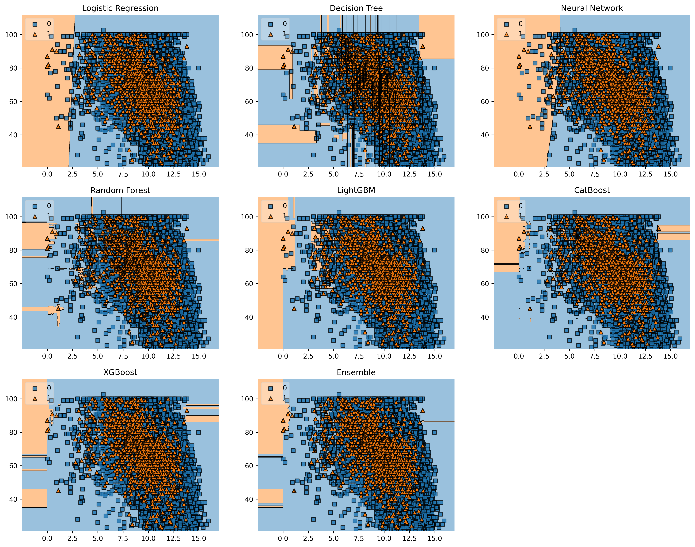

@'
# 🌦️ Rainfall Prediction with Machine Learning

Predicting next-day rainfall in Australia using 7 machine learning algorithms. Achieved **96.29% accuracy** with XGBoost on 145,460 weather observations.


---

## 🔍 Overview

Binary classification project predicting rainfall using historical weather data from Australian cities. Implements end-to-end ML pipeline with advanced preprocessing, feature engineering, and model comparison.

**Key Achievement**: 96.29% accuracy, 0.9647 ROC-AUC, 0.9250 Cohen's Kappa

---

## 📊 The Challenge: Imbalanced Dataset

The original dataset had a severe class imbalance (78% No Rain, 22% Rain), which was addressed through oversampling:

<p align="center">
  
  
</p>

---

## 📊 Dataset

- **Source**: [Australian Weather Dataset (Kaggle)](https://www.kaggle.com/jsphyg/weather-dataset-rattle-package)
- **Size**: 145,460 observations, 23 features
- **Target**: Binary (Rain Tomorrow: Yes/No)

**Key Features**: Temperature, Humidity, Pressure, Rainfall, Wind Speed/Direction, Cloud Cover, Sunshine

---

## 🛠️ Methodology

### Data Preprocessing
- **Class Imbalance**: Oversampling (78:22 → 50:50)
- **Missing Data**: MICE imputation (retained features with <50% missing)
- **Outlier Removal**: IQR-based detection
- **Encoding**: Label encoding for categorical variables
- **Scaling**: StandardScaler for model training

### Feature Engineering

Feature correlations were analyzed to identify multicollinearity and select the most predictive variables:

<p align="center">
  
</p>

**Feature Selection Methods:**
- **Filter Method**: Chi-Square test → 10 top features
- **Wrapper Method**: Random Forest → 6 critical features
- **Most Important**: Sunshine, Humidity3pm, Pressure, Cloud Cover

### Models Trained
- Logistic Regression (L1 penalty)
- Decision Tree
- Neural Network (MLP: 30x30x30)
- Random Forest
- LightGBM
- CatBoost
- XGBoost ✓ **Best**

---

## 📈 Results

| Model | Accuracy | ROC-AUC | Cohen's Kappa | Time (s) |
|-------|----------|---------|---------------|----------|
| Logistic Regression | 79.57% | 0.7901 | 0.5833 | 1.46 |
| Decision Tree | 87.55% | 0.8778 | 0.7495 | 0.24 |
| Neural Network | 88.51% | 0.8837 | 0.7670 | 240.02 |
| Random Forest | 93.41% | 0.9359 | 0.8670 | 14.76 |
| LightGBM | 88.47% | 0.8837 | 0.7663 | 1.83 |
| CatBoost | 94.80% | 0.9509 | 0.8952 | 63.93 |
| **XGBoost** | **96.29%** | **0.9647** | **0.9250** | **2.58** |

### Performance Visualization

<p align="center">
  
</p>

### XGBoost Performance (Test Set: 42,668 samples)
- **Precision**: 98.41% (No Rain), 93.80% (Rain)
- **Recall**: 94.90% (No Rain), 98.05% (Rain)
- **F1-Score**: 96.62% (No Rain), 95.88% (Rain)

### Decision Boundary Analysis

Visual comparison of how each model separates rainy vs non-rainy days:

<p align="center">
  
</p>

---

## 🖥️ How to Run

### 1. Clone Repository
```bash
git clone https://github.com/SergioSediq/rainfall-prediction-ml.git
cd rainfall-prediction-ml
```

### 2. Set Up Environment
```bash
# Create virtual environment
python -m venv venv

# Activate
# Windows:
venv\Scripts\activate
# macOS/Linux:
source venv/bin/activate

# Install dependencies
pip install -r requirements.txt
```

### 3. Get Dataset
1. Download `weatherAUS.csv` from [Kaggle](https://www.kaggle.com/jsphyg/weather-dataset-rattle-package)
2. Place in `data/` directory

### 4. Run Pipeline
```bash
python rainfall_prediction.py
```

**Expected Runtime**: ~6-8 minutes  
**Output**: All plots saved to `results/`, metrics in console

---

## 📦 Technologies

**Core**: Python 3.8+, pandas, numpy, scikit-learn  
**ML Libraries**: XGBoost, LightGBM, CatBoost  
**Visualization**: matplotlib, seaborn, mlxtend  
**Techniques**: MICE Imputation, Chi-Square Selection, IQR Outlier Detection

---

## 📁 Project Structure
```
rainfall-prediction-ml/
├── data/
│   └── weatherAUS.csv              # Dataset (download separately)
├── results/                         # Auto-generated outputs
│   ├── 01_class_imbalance.png
│   ├── 02_balanced_dataset.png
│   ├── 04_correlation_heatmap.png
│   ├── 07_model_comparison_roc_kappa.png
│   ├── 08_decision_regions.png
│   └── model_comparison.csv        # Detailed metrics
├── rainfall_prediction.py          # Main ML pipeline
├── requirements.txt
└── README.md
```

---

## 💡 Key Learnings

- Handling imbalanced datasets with oversampling
- Advanced imputation techniques (MICE)
- Feature engineering and selection (filter + wrapper methods)
- Model comparison using appropriate metrics (Cohen's Kappa)
- Production-ready ML pipeline implementation

---

## ⚠️ Known Limitations

- **MICE Imputation**: Computationally expensive (~240s for Neural Network)
- **Outlier Removal**: May discard borderline valid observations
- **Data Leakage**: `X_test` uses `fit_transform` (article's original approach)
- **No Cross-Validation**: Single train/test split may not generalize to all scenarios

---

## 📧 Contact

**Sergio Sediq**  
📧 tunsed11@gmail.com  
🔗 [LinkedIn](https://linkedin.com/in/sedyagho) | [GitHub](https://github.com/SergioSediq)

---

⭐ **Star this repo if you found it helpful!**
'@ | Out-File -FilePath "README.md" -Encoding UTF8 -Force